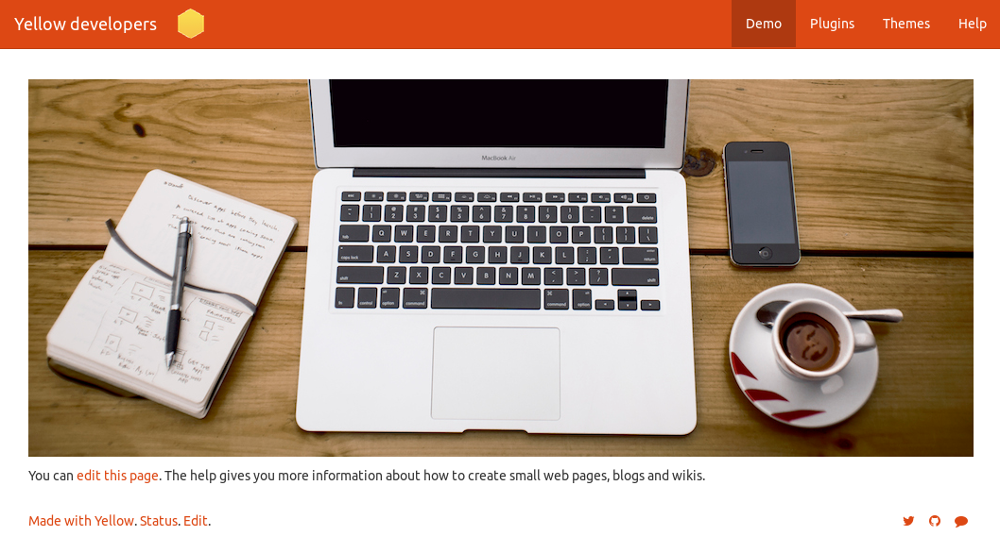

# YellowBootstrap

[Bootstrap](http://getbootstrap.com/) framework and [Bootswatch](http://bootswatch.com/) themes integration for the [Yellow](https://github.com/datenstrom/yellow) flat-file CMS system.



## Installation

* Copy `bootstrap.php` plugin file into system/plugins folder.
* Copy `bootstrap-navigation.php` navigation file into system/themes/snippets folder.
* Copy `bootstrap.css` theme file into system/themes folder.

## Configuration

This plugin supports the following changes in system/config/config.ini file:

* Set `Theme: bootstrap` to use the Bootstrap/Bootswatch theme.
* Set `Navigation: navigation-bootstrap` to use the Bootstrap/Bootswatch navigation bar.

`bootstrapCdnCSS` and `bootstrapCdnJS` settings point to the [Bootstrap CDN](https://www.bootstrapcdn.com/) v3.3.6 by default.

If you need to change the default CDN URLs, you can add one or both key settings in system/config/config.ini.

The following example sets the CMS to use the [cerulean](http://bootswatch.com/cerulean/) v3.3.6 Bootswatch theme:
```
bootstrapCdnCSS: https://maxcdn.bootstrapcdn.com/bootswatch/3.3.6/cerulean/
```
